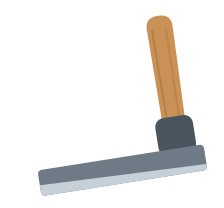

<p align="center">
  
</p>

<h1 align="center">froe</h1>

<p align="center">
  <em>A local-first coding agent for the terminal and Neovim.<br>
  Small bounded commands, a 4&nbsp;GB-VRAM laptop, and no source code leaving the machine.</em>
</p>

<p align="center">
  <a href="#install">Install</a> ·
  <a href="#the-commands">Commands</a> ·
  <a href="#why-it-is-not-an-autonomous-agent">Why this shape</a> ·
  <a href="docs/ARCHITECTURE.md">Architecture</a>
</p>

---

## What a froe is

A froe is a riving tool. You set the blade on the end grain, strike the spine
with a wooden club, and lever the handle to **split the wood along its own
grain**. It has no swing of its own — a person supplies every bit of the force,
and all of the judgement about where the grain actually runs. Riven wood follows
the fibres, which is why it is stronger than sawn.

That is the design of this thing, not just its name. The model does the
concentrated work of one stroke. You decide where the stroke lands.

## The commands

Each one does a single job with a fresh context, the smallest turn budget that
fits, and then hands control straight back to you.

```bash
froe locate "<issue text>"    # WHERE in the code does this live? (read-only)
froe commit -a -m "…" -p      # staged diff → message → commit → push
froe ask "<question>"         # one question, one answer, no tools
froe map                      # the project map the model is given
froe doctor                   # what this machine can actually run
froe chat                     # interactive session with memory
froe memory                   # durable facts about this project
froe sessions                 # list or replay past conversations
froe do "<task>"              # the full agent loop, for a job that fits in one
```

From Neovim, over JSON-RPC to the same binary:

```vim
:Froe fix the null guard in this function
```

## Why it is not an autonomous agent

Because it was measured, and the autonomous loop lost. A 27B model at an
8192-token context was pointed at a real issue: remove one field from a report
table, four edit sites, in a 1435-line file inside a 5651-file repository.

| run | outcome |
|---|---|
| 1 | 21 turns, 7m14 — 3 of 4 sites, left a row with 6 cells against 5 headers |
| 2 | died at turn 4, context overflow |
| 3 | 24 turns, 7m10 — 2 of 4 sites |
| 4 (read-only) | found all sites by turn 4, then wandered to the turn limit |

**The failure was never capability.** In every run it found the right file from a
path the issue got *wrong*. It noticed that a `col_widths` list was positionally
coupled to its headers — a constraint nobody had stated. That is good
engineering judgement.

**The failure was memory.** Run 3 spent turns 12 to 23 hunting for the issue's
phantom path, two turns *after* it had already edited the real file.

So the state lives in you and in the conversation, rather than in a context
window that cannot hold it. The full decision log (D26 and the rest) is being
rewritten against fresh measurements and will land in `docs/DECISIONS.md`
shortly.

### The second half of the answer: check the model after it stops

The bigger lever turned out not to be a larger context or a better prompt. It is
**deterministic Go that verifies the model's answer once it has finished**.

`froe locate` re-runs the model's own successful searches inside the files it
cited, and reports the lines it missed. That costs no turns and no tokens, and
most of `locate`'s reliability came from it rather than from anything the model
was told. Measured on a fixture built at the real thing's difficulty — 405 Python
files, an 1876-line target, four decoys that all match the obvious glob:

| | pass rate (3 repeats) | median turns |
|---|---|---|
| baseline | 0/3 | 6 |
| + relaxed separators in the verification sweep | 1/3 | 6 |
| + searches derived from the report's own quoted phrases | 2/3 | 6 |
| + **searching the project before turn 1** | **3/3** | **4** |

## Why it exists

1. **Data governance.** For anyone working under UK/EU data-residency rules,
   source code should not have to leave the machine, the LAN, or at the very
   least the EU. A local model is the default path here, not an afterthought
   bolted onto a cloud tool.
2. **Model churn.** The best local model changes every few months. Nothing about
   a model is compiled in — models are registry entries, hardware profiles are
   detected, and a runtime is a binary path rather than a name.
3. **Modest hardware, honestly.** It runs on a 4 GB-VRAM work laptop and is
   designed around that, not around a machine that is not coming. `froe doctor`
   measures what a box can actually do instead of assuming.
4. **Neovim is the editor.** Not "there's a VS Code extension, and also a
   terminal mode". The editor integration is a first-class client of the same
   binary.

## Install

```bash
gh repo clone dcoldeira/froe
cd froe
go install ./cmd/froe     # → ~/go/bin/froe   (make install → ~/.local/bin instead)
froe doctor
```

Then point it at a model runtime. Froe speaks OpenAI-compatible
`/v1/chat/completions` as its lingua franca, so llama.cpp, Ollama, LM Studio and
vLLM all work through one adapter. Mistral (EU-hosted) is the cloud fallback for
when local hardware can't fit the job — the sane choice when governance forbids
US processing; Anthropic has its own adapter for those who want it regardless.
Full walkthrough, including a headless LM Studio and the Neovim plugin:
[`docs/SETUP.md`](docs/SETUP.md).

⚠ One runtime footgun worth knowing before you hit it: Ollama's `num_ctx`
defaults to 4096 and **silently truncates** everything past it.

## Design in one paragraph

A single static Go binary (~14k lines) holds the agent loop, the tool
implementations and the provider adapters. Tool calls are produced three
different ways — GBNF grammar, native tool-calling, or a ReAct text protocol —
because which one works is a property of the *model*, not a global default. A
~550-line Lua plugin drives the same binary from Neovim over JSON-RPC on stdio,
the LSP pattern, so the editor and the terminal share one implementation, one
permission gate and one session store.

- [`docs/ARCHITECTURE.md`](docs/ARCHITECTURE.md) — how the pieces fit
- [`docs/MODELS.md`](docs/MODELS.md) — the registry, hardware profiles, runtimes
- [`docs/SETUP.md`](docs/SETUP.md) — bare machine to working install
- [`docs/ROADMAP.md`](docs/ROADMAP.md) — open work, each item from an observed problem
- `docs/DECISIONS.md`, `TESTING.md` — coming shortly, being rewritten against
  fresh measurements

## Evaluation

`eval/` holds a handful of tasks, each scored as a **pass rate over repeats**
rather than a single run — variance between identical runs of an agent is
large enough to swamp the effect of a real fix, so one run cannot tell you
whether a change helped. A task can name the command it exercises, so a
stepwise command is measured as itself instead of being approximated with
`do`. More tasks (including the ones exercising `froe locate`) are being
rewritten against fresh measurements and will land shortly.

```bash
bash eval/run.sh            # all tasks
ONLY=01-fix-panic bash eval/run.sh
```

## Status, honestly

Public since 2026-09-23.

In daily use for commits: `froe commit` drives the release process for
[QRL](https://github.com/entangledcode/qrl) and [Bell](https://bell.entangledcode.dev),
the two projects it was built to develop. `froe locate` is the first of the stepwise
commands and is measured above. `explain`, `plan` and `step` are next.

**Not claimed:** this is not a replacement for a frontier-model coding agent, and
it is not trying to be. It is what a 4 GB-VRAM laptop can honestly do, plus a lot
of deterministic Go making sure the model did not quietly get it wrong.

One design point worth calling out: for `froe commit`, the model is only ever
asked for *message text*, never for commands. Every git call is fixed Go with a
fixed argv and no shell.

## Licence

MIT — see [`LICENSE`](LICENSE). Contributions are covered by [`CLA.md`](CLA.md);
sign it before a pull request can be merged.
